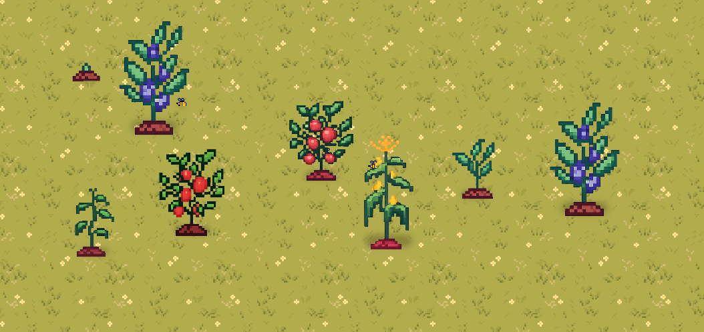
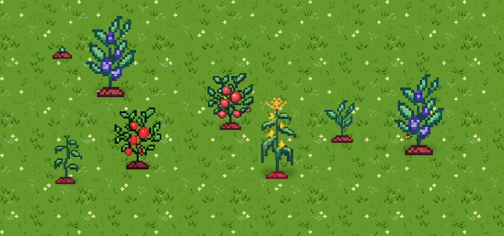
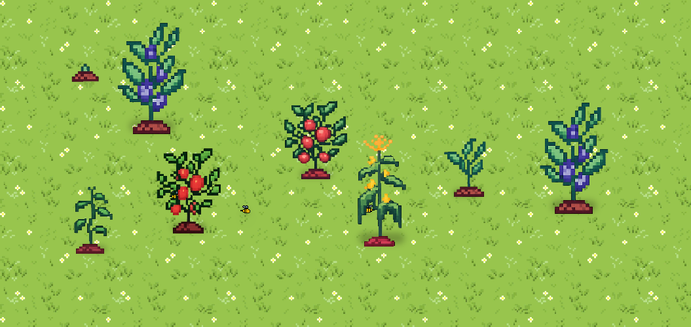
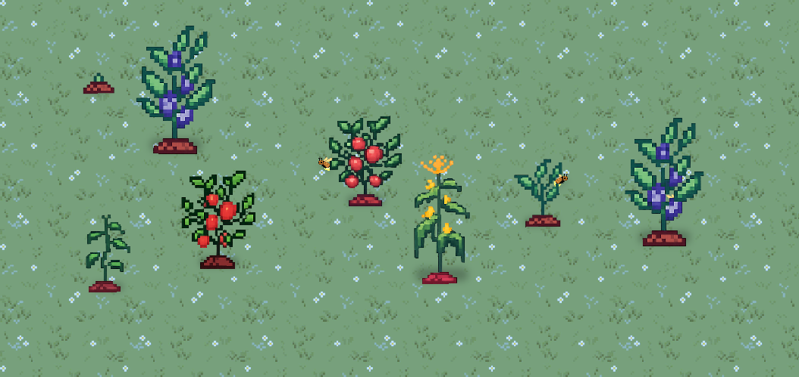
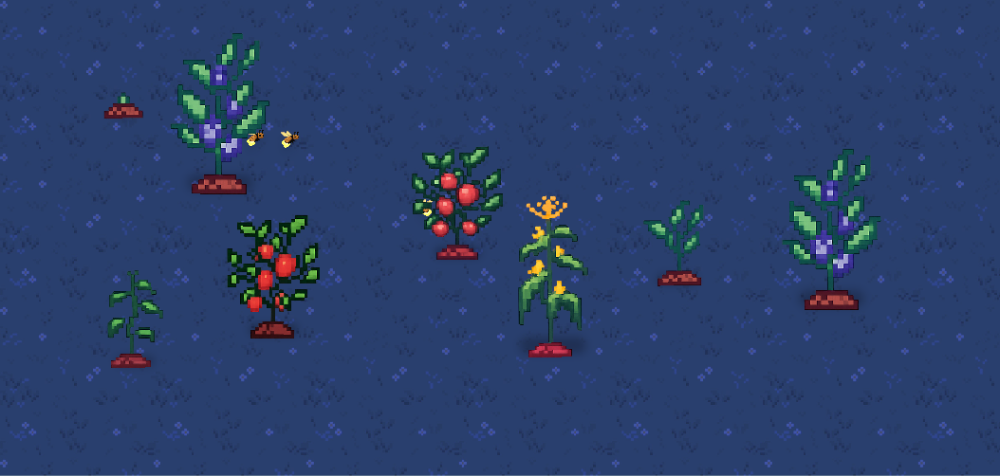
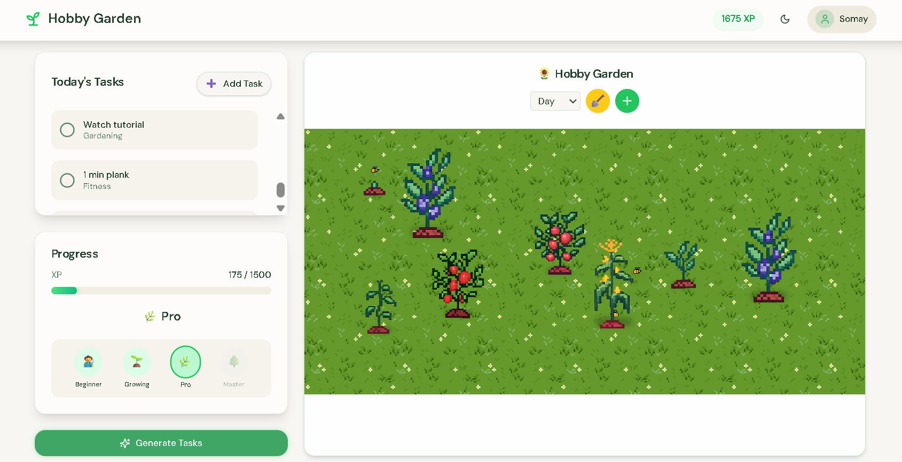
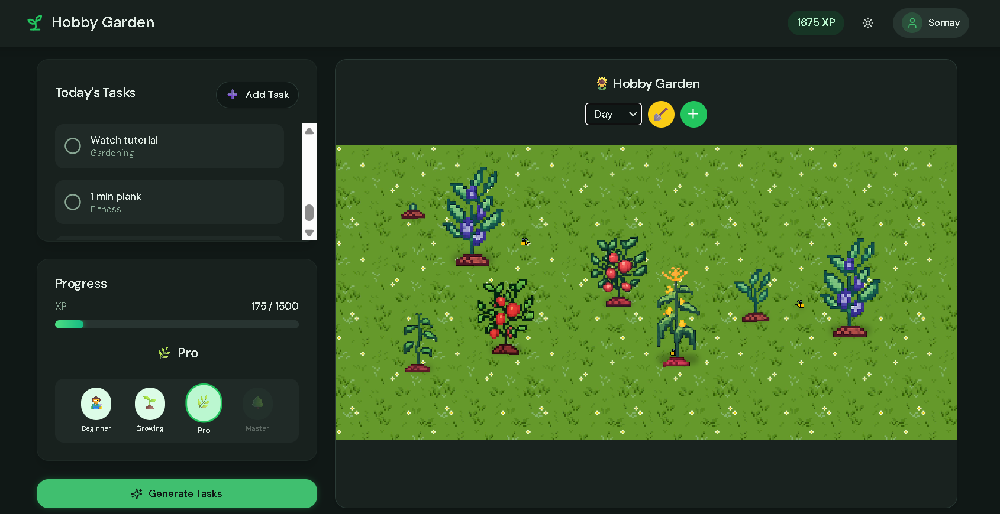
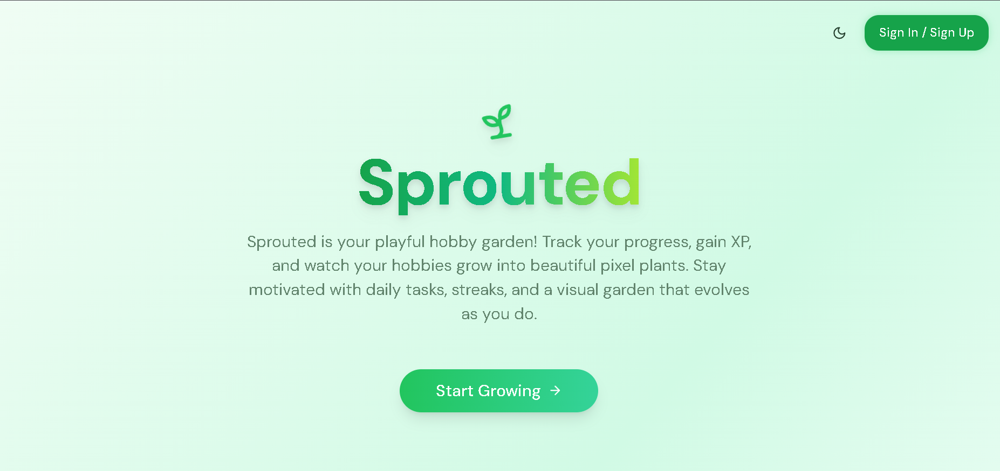
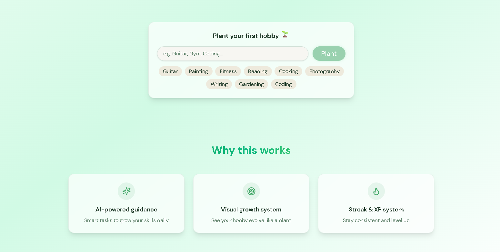

# 🌱 Sprouted - Demo Login Available!

**Demo Account:**  
`demo@example.com` / `demo123`  
*(Create with seed script below or already seeded in production DB)*

Welcome to **Sprouted**! Sprouted is designed to encourage you to follow through with your hobbies and daily tasks by making the process interactive and meaningful. As you complete tasks and pursue your hobbies, you grow a beautiful pixel-art garden and level up as a gardener-giving your progress a real sense of purpose and fun.

Here's a tour of the coolest features that make Sprouted unique and motivating:

---

## ✨ Features

### 1. Dynamic Garden Themes
- **Time of Day:** The garden background and lighting change automatically based on the real-world time-enjoy sunny mornings, golden afternoons, and starry nights!
- **Manual Theme Selection:** Prefer a specific vibe? Use the dropdown in the garden to pick your favorite theme anytime.

### 2. Interactive Pixel Plants
- **Plant Growth:** Completing tasks and hobbies grows your plants from seedlings to lush, mature forms. Each plant type has unique pixel art!
- **Plant Variety:** Choose from 5+ plant types, each with its own sprite and growth stages.

### 3. Bees & Fireflies
- **Daytime Bees:** Watch adorable bees buzz around your garden during the day, adding life and charm.
- **Nighttime Fireflies:** As night falls, magical fireflies appear, twinkling among your plants.

### 4. Level Up & Progression
- **Gardener Levels:** Earn XP by completing tasks and hobbies. Level up to unlock new plant types and garden features.
- **Progress Bar:** Track your XP and see how close you are to the next level with a satisfying progress bar.

### 5. Customizable Garden
- **Tile Themes:** Change the look of your garden tiles to match your mood or season.
- **Plant Placement:** Arrange your plants however you like-design your dream pixel garden!

### 6. Habit & Task Tracking
- **Hobbies:** Add and manage your hobbies. Each hobby grows a unique plant.
- **Daily Tasks:** Complete daily tasks to earn XP and help your garden thrive.

### 7. Persistent Progress
- **Cloud Save:** Your progress is saved securely-pick up where you left off on any device.

---

## 🖼️ Screenshots

### Dawn Garden (Time of Day)


### Day Garden (with Bees)


### Noon Garden


### Dusk Garden


### Night Garden (with Fireflies)


### Hobby Garden (Light Theme)


### Hobby Garden (Dark Theme)


### Landing Page


### Why This Works Section


---

## 🚀 Get Started

### Backend Setup
```bash
cd backend
npm install
# Add .env: MONGO_URI=your_mongo_uri, JWT_SECRET=your_secret
npm run dev  # nodemon server.js
```

### Seed Demo User (idempotent)
```bash
node backend/scripts/seedDemoUser.js
```

### Frontend
```bash
pnpm install  # or npm install
pnpm run dev
```

**Vercel Deployment:**
- Frontend: Direct Vercel deploy (sets NEXT_PUBLIC_API_URL automatically if backend proxied).
- Backend: Deploy as Vercel Serverless Functions or separate service (Render/Railway). Run seed script once via Vercel CLI or console against prod MongoDB.
- Env vars: MONGO_URI, JWT_SECRET for both.

---

## 💡 Tips
- Use demo account to test published site instantly!
- Try completing tasks at different times of day to see the garden change!
- Level up to unlock new plants and features.
- Explore the garden at night for a magical surprise.

---

Enjoy growing your productivity, one pixel at a time! 🌸
